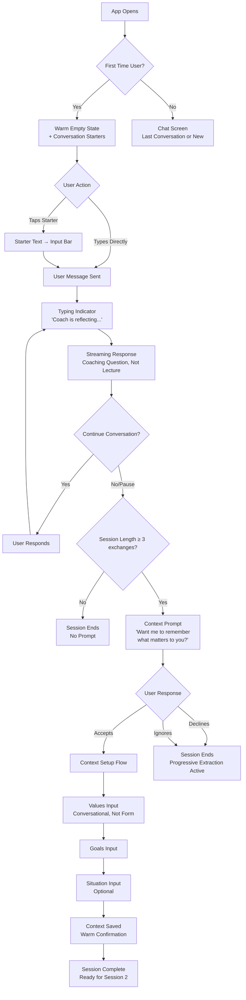
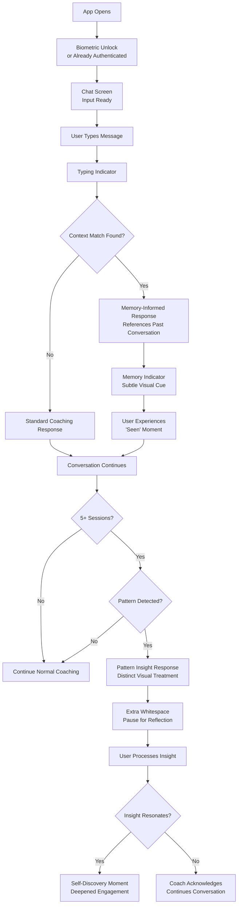
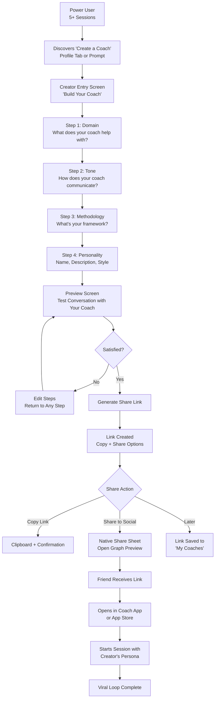
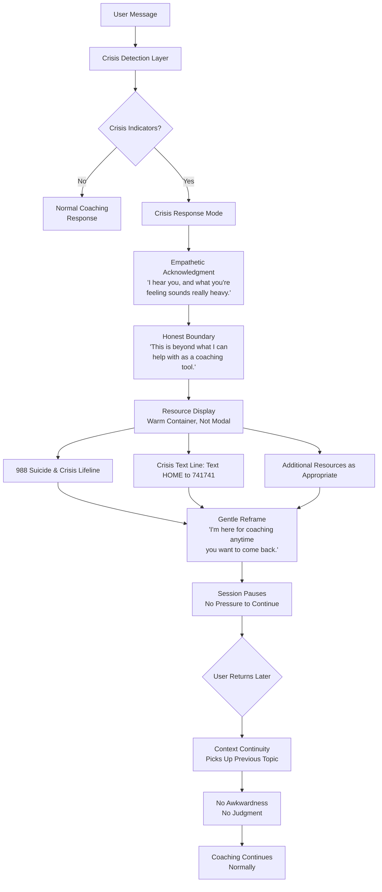

# UX Design Specification — Coach App

**Author:** Sumanth
**Date:** 2026-01-28

---

## Executive Summary

### Project Vision

Coach App is a chat-first AI coaching product built around the tagline "AI coaching that remembers who you are." The entire experience centers on a single conversational interface where users talk about whatever is on their mind and receive personalized coaching across 7 domains (life, career, relationships, mindset, creativity, fitness, leadership) — with zero category selection. A persistent personal context layer retains values, goals, life situation, and conversation history across every session, delivering coaching that deepens over time rather than starting from scratch.

The product ships cross-platform (iOS + web) from a single Expo/React Native codebase. The architecture defines 4 main tabs (Chat, History, Profile, Settings), auth screens, creator tool screens, an operator dashboard, and a shared coaching persona entry point via deep links. Components follow atomic design principles with NativeWind/Tailwind CSS for consistent styling across platforms.

### Target Users

**Primary — The Guidance Seeker:** Ages 22-40, unified by being at a crossroads. Triggered by specific moments — tough feedback, arguments, anxiety about decisions. Opens the app at 10:47pm when they need someone who gets their situation. Current workaround is ChatGPT, which forgets them every session. Success: they have a place to go that knows them, challenges them, and helps them move forward — right now, not next Thursday.

**Primary — The Self-Improvement Enthusiast:** Proactive power users who engage 3-4x/week across domains. Already read the books — they need help applying knowledge to their specific context. They explore coaching domains deliberately and are the first to discover creator tools. Success: the gap between "I know what to do" and "I'm actually doing it" closes.

**Secondary — The Coach Creator:** Starts as a user, discovers creator tools, builds a coaching persona in under 10 minutes (domain, tone, methodology), and shares via link. For certified coaches, the AI version becomes a lead-generation funnel to premium human coaching. Success: they build, share, and see people using their coach.

### Key Design Challenges

1. **The "Zero Friction vs. Zero Context" Tension** — The product promises zero-friction first sessions AND personalized coaching. But session 1 has no context yet. The UX must make the first session compelling enough to reach the context prompt, and the transition from "stranger" to "someone who knows me" must feel natural, not jarring.

2. **Streaming Chat That Feels Like Coaching, Not ChatGPT** — Every AI chat app uses the same visual language: bubbles, typing indicators, streaming text. Coach App needs to feel like a coaching session — depth, warmth, intentionality — not a tech demo. The visual design must signal that this is different.

3. **The Pattern Recognition Moment** — The product's most powerful moment ("you've brought this up three times") could feel insightful or creepy. The UX treatment of pattern insights — visual distinction, tone, timing, user control — is critical to retention.

4. **Crisis Detection UX** — When someone in distress gets redirected to crisis resources, the transition must feel caring, not robotic. Standard UI patterns (modals, alerts) will feel cold. This interaction needs its own emotional design language.

5. **Invisible Domain Routing = Invisible Value** — Users never see domain routing happen. That's the design intent. But users might not realize the breadth of what Coach App handles. The UX must subtly communicate multi-domain capability without adding friction or feature lists.

6. **Offline State Communication** — Reading past conversations offline but not being able to chat is an unusual partial-offline state. The UX must clearly communicate what's available vs. not without making the app feel broken.

### Design Opportunities

1. **The "Memory Moment" as a Signature Interaction** — When the AI references a past conversation, this could be a distinct visual moment — not just text in a bubble. A subtle design cue that says "I remembered this" becomes Coach App's signature UX moment that users screenshot and share.

2. **Context Profile as a Living Document** — Most apps treat profiles as settings screens. Coach App's context profile is the core differentiator. Designing it as a personal mirror — showing how the AI sees the user, inviting refinement — creates a genuinely novel screen that reinforces the value proposition.

3. **Creator Tools as a "Build Your Coach" Experience** — Instead of a standard form, persona creation could feel like sculpting a personality — expressive, with real-time preview of coach responses. This makes creation feel creative, not administrative, and increases completion rate.

## Core User Experience

### Defining Experience

The core experience is a single conversational interface where users type what's on their mind and receive streaming coaching responses informed by their personal context. Every other screen exists to support or deepen this exchange.

**Core Loop:**
1. User opens app → lands on chat (zero navigation to start)
2. User types what's on their mind — or taps a conversation starter for emotional entry — no category, no prompt selection
3. AI responds with streaming coaching informed by context, domain, and history
4. Over time, the AI references past conversations, identifies patterns, and deepens the relationship

**The "Remember Me" Loop (secondary, drives retention):**
1. First session ends → gentle prompt: "Want me to remember what matters to you?"
2. User adds values/goals/situation → context layer activates
3. Next session → AI references context → user feels seen
4. Progressive extraction deepens context through conversation → coaching improves → user stays

**Design Ambition:** Every interaction in Coach App should feel considered. Not just the chat — the history screen, the profile editor, empty states, error messages, loading moments, onboarding prompts, and settings. Each touchpoint is an opportunity to reinforce that this product was made by someone who cares, not generated by a machine.

### Platform Strategy

**Primary Platforms:** iOS app + web SPA from a single Expo/React Native codebase.

**iOS (primary development target):**
- Touch-first interaction design
- Face ID / Touch ID for frictionless re-entry
- Native keyboard handling for chat (critical to get right)
- APNs for proactive coaching nudges
- App Store distribution

**Web (parity target):**
- Mobile-first responsive — web on phone should feel close to native
- Desktop layout requires dedicated design attention: a chat interface that feels intimate on a phone can feel lonely on a 27-inch monitor. Centered chat column with sidebar for history on wide screens is the starting point, but desktop-specific layout decisions are flagged for the layout/navigation step.
- Standard email + social auth (Passkey deferred post-MVP)
- Web Push for notifications

**Offline:** Read-only access to past conversations and context profile. Clear, warm messaging when offline — not a cold error state. "You're offline right now. Your past conversations are here — new coaching needs a connection."

**Cross-Platform Parity:** Feature parity within 1 sprint. If it ships on iOS, it ships on web in the same cycle.

### Effortless Interactions

**Zero-Friction Start:**
- App open → chat screen. No splash screen tutorials, no onboarding wizard, no "pick your coaching area" screen.
- First-time users see a warm welcome empty state with 2-3 conversation starters — emotional entry points, not categories. Examples: "Something's been on my mind," "I need help thinking through a decision," "I want to set a goal." These lower the barrier to typing the first message. They disappear after session 1.

**Invisible Domain Routing:**
- User talks about career → gets career coaching expertise. Talks about relationships → gets relationship depth. Never sees a toggle, dropdown, or category label during the conversation. A subtle domain badge on the conversation card in history is enough.

**Context Setup That Doesn't Feel Like a Form:**
- Post-first-session prompt is conversational, not a settings modal
- Progressive extraction means the AI learns context from conversations — users who never touch their profile still get personalization
- Profile editing is inline and warm — edit values/goals in place, not in a buried settings screen

**Seamless Streaming:**
- Token-by-token rendering that feels like the coach is thinking and speaking, not like data is loading
- **Design constraint:** Pure single-token rendering at LLM speed can look jittery. A small render buffer (50-100ms, batching 2-3 tokens) produces smoother text appearance that feels like coaching pace, not data dump. This is an implementation detail with direct UX impact.
- Typing indicator before first token that feels like presence, not a spinner
- Interrupted streams display partial content with a gentle "Continue" option — no error modals

**Effortless Re-Entry:**
- Biometric unlock → straight to last conversation or new chat
- Conversation history accessible in one tap from the tab bar
- No "session expired" walls — Supabase handles token refresh silently

### Critical Success Moments

**Moment 0: First Context Profile Discovery**
The first time a user opens their Profile tab and sees what the AI has learned about them. This moment could feel like a "whoa, it gets me" or "that's creepy." The design must land on the right side: transparent about what's stored, warm in presentation, with easy inline editing. Frame it as "here's how I see you — correct me anytime" rather than "here's what I've collected."

**Moment 1: First Response (Session 1)**
The very first coaching response determines whether the user comes back. Without context, this response must still feel specific, thoughtful, and coaching-oriented — not a list of tips. The AI should ask a grounding question, not lecture. This is where "coaching, not ChatGPT" is proven or broken. Conversation starters help bridge the user into this moment by lowering first-message anxiety.

**Moment 2: The Context Prompt (End of Session 1)**
"Want me to remember what matters to you?" — this moment must feel like an invitation, not a data collection form. The phrasing, timing, and visual treatment determine whether 60%+ of users set up context (the target).

**Moment 3: The Memory Reference (Session 2+)**
The first time the AI says something like "Last time you mentioned feeling overlooked — this sounds related" — the user feels seen. This is the emotional conversion point. The UX should subtly highlight this moment — the Edge Function can tag context-informed responses with a metadata flag, allowing `StreamingText.tsx` to apply a distinct visual treatment without being heavy-handed.

**Moment 4: The Pattern Insight (Session 5+)**
"You've brought this up three times now..." — cross-session pattern recognition. This is the moment coaching becomes transformative. The visual treatment should distinguish this from a regular response — it's an insight, not just a reply.

**Moment 5: The Crisis Boundary (When Needed)**
When crisis indicators are detected, the transition to resources must feel like care, not a system alert. Empathetic acknowledgment → resource display → gentle reframe. The user should feel held, not handled.

**Moment 6: Creator "Aha" (Power Users)**
The moment a power user realizes "I could build a coach for my thing" — the creator tools entry point should feel like a natural evolution, not a hidden feature. Discoverable but not pushy.

**Moment 7: Trial-to-Paid Conversion**
The paywall should appear after a memory moment has landed — not on an arbitrary timer. If the user hasn't experienced the "AI that remembers me" promise, asking them to pay is asking for money before delivering value. The conversion prompt should feel like "you've experienced what this can do — keep going" rather than "your free time is up." Gentle, tied to value, not a wall.

### Experience Principles

1. **Warm Over Cold** — Every surface of the app should feel human-crafted, not machine-generated. Warm color palette, considered typography, rounded edges, gentle animations. The aesthetic says "someone who cares made this" — not "an AI generated this interface."

2. **Every Interaction Matters** — No throwaway screens. Empty states, error messages, loading moments, settings pages, and transition states all receive the same design attention as the core chat. If a user touches it, it should feel intentional.

3. **Coaching, Not Chatting** — The visual language differentiates Coach App from generic AI chat. Pacing, whitespace, response formatting, and interaction patterns should feel like a coaching session — reflective, spacious, grounded — not a rapid-fire message thread.

4. **Show, Don't Tell** — The AI's memory and intelligence should be demonstrated through the experience, not explained with feature labels. Users discover depth by experiencing it, not by reading about it on an onboarding screen. This is the hardest principle to uphold and the easiest to violate — every tooltip suggestion should be tested against it.

5. **Gentle Over Aggressive** — Prompts, notifications, upsells, and CTAs are invitations, never demands. The context prompt is a question, not a form. The trial expiration is a nudge, not a wall. Crisis resources are offered, not forced. The app earns trust by respecting autonomy.

6. **Accessible by Default** — WCAG 2.1 AA is the floor, not the ceiling. Screen reader labels, keyboard navigation, dynamic type, reduced motion support, and high contrast are built in from the start — not bolted on later. Accessibility is a design principle, not a compliance checkbox.

## Desired Emotional Response

### Primary Emotional Goals

Coach App's emotional signature is **safe, seen, and grounded.** The experience should feel like a late-night conversation with a wise friend — not a productivity tool, not a therapy session, not a chatbot. Every design decision filters through this emotional register.

**The Core Emotional Promise:** When the AI remembers something personal, the user feels *seen* — not *watched*. "Seen" is warm, human, relational. "Watched" is surveillance, data, systems. This distinction is the single most important emotional design challenge in the product. Every visual treatment of memory, context, and personalization must land on the "seen" side.

**Primary Emotions to Evoke:**
- **Safe** — Users are sharing vulnerable thoughts. The environment must feel nonjudgmental, private, and trustworthy before a single word is typed.
- **Seen** — The product's core emotional payoff. "This AI actually knows me" should feel like being understood by someone who cares, not profiled by a system.
- **Grounded** — Coaching should help users feel more centered, not more anxious. The pacing, tone, and visual language should create a sense of calm clarity.

### Emotional Journey Mapping

| Stage | Target Emotion | Design Implication | Emotion to Avoid |
|---|---|---|---|
| **First open** | Welcomed, curious | Warm empty state, inviting conversation starters, no walls or forms | Overwhelmed, interrogated |
| **First message** | Safe to be honest | No judgment signals, private-feeling interface, warm input bar | Judged, performing for an audience |
| **First response** | Heard, understood | Coaching question (not a lecture), pacing that feels thoughtful | Lectured, given a generic list |
| **Context prompt** | Invited, valued | Conversational phrasing ("Want me to remember?"), optional, no pressure | Data-mined, surveilled |
| **Context profile view** | Known, in control | "Here's how I see you" framing, easy inline editing, transparent | Creeped out, tracked |
| **Memory reference** | Seen, connected | Subtle visual cue on memory-informed responses, warmth not highlight | Watched, analyzed |
| **Pattern insight** | Self-aware, moved | Distinct visual treatment, reflective pacing, space to sit with the insight | Cold-read, diagnosed |
| **Crisis boundary** | Held, cared for | Empathetic tone, warm resource presentation, "I'm still here when you're ready" | Rejected, system-errored, abandoned |
| **Returning after absence** | Relief, continuity | Picks up where they left off, no guilt, no "you've been away" shaming | Starting over, forgotten |
| **Trial ending** | Investing in growth | Tied to a value moment, framed as continuing the relationship | Losing access, punished |
| **Offline state** | Calm, informed | Warm language ("your conversations are here"), read access preserved | Broken, cut off, frustrated |
| **Error state** | Patient, reassured | Friendly language, clear next action, "we'll try again" tone | Confused, abandoned, technical |

### Micro-Emotions

**Critical Emotional Pairs (ordered by importance to Coach App):**

1. **Trust over Skepticism** — Users share vulnerable, personal things. If the interface feels cold, corporate, or data-driven, they hold back. Trust is built through warmth, transparency, and consistency — not privacy policy links.

2. **Confidence over Confusion** — The user should always feel like they know what to do next without being told. Navigation, prompts, and actions should feel intuitive. When in doubt, fewer choices is better than more.

3. **Belonging over Isolation** — Talking to an AI at 11pm could feel lonely. The warmth of the interface — color, typography, spacing, tone — must counteract that. The user should feel like they're in a safe, welcoming space, not talking to a void.

4. **Accomplishment over Frustration** — After a coaching session, the user should feel like they moved forward, even if the topic is hard. The experience should end with a sense of progress, not open loops.

5. **Delight over Mere Satisfaction** — Small moments of craft — a smooth animation, a thoughtful transition, an unexpectedly warm empty state — signal care. These aren't features; they're feelings. They're what make someone say "I love this app" instead of "it works fine."

### Design Implications

**Trust → Warm Visual Language:**
- Warm color palette (earth tones, soft accents — not sterile blues or pure whites)
- Rounded corners, generous padding, soft shadows
- Typography that feels friendly and readable, not technical or trendy
- No dark patterns, no manipulative urgency, no countdown timers

**Seen → Memory Moment Treatment:**
- Context-informed responses receive a subtle visual distinction — a warm accent, a gentle highlight, or a small icon — that says "I remembered this" without shouting
- Pattern insights use whitespace and pacing to create a reflective moment — not another chat bubble, but a moment of pause
- The context profile screen feels like a mirror, not a dossier — warm framing, editable, transparent

**Grounded → Coaching Pace:**
- Streaming text appears at a pace that feels thoughtful, not rushed (50-100ms render buffer)
- Generous whitespace between messages — the chat should breathe, not feel like a log
- Typing indicator feels like presence ("the coach is reflecting") not loading ("processing your request")
- After a response, a brief pause before the input bar re-activates — creating space to absorb

**Safe → Error & Edge Case Warmth:**
- Error messages use first person: "I couldn't connect right now — let's try again" not "Error 503: Service unavailable"
- Offline banner is warm and informative, not alarming
- Crisis resources are presented with care — warm container, breathing room, "I'm still here" language
- Session timeouts are invisible — no "your session expired" disruptions

**Belonging → Craft Details:**
- Empty states have personality — not "No conversations yet" but something that invites
- Transitions between screens feel smooth and intentional
- Loading states use skeleton screens that match the warm aesthetic, not generic spinners
- Sound and haptics (if added later) should be subtle, calming, and optional

### Emotional Design Principles

1. **Safety First, Always** — Every design decision starts with "does this feel safe?" If a feature, prompt, or visual element could make a user hesitate to be honest, it fails the safety test. Privacy, warmth, and nonjudgment are non-negotiable.

2. **Seen, Not Watched** — Personalization features (memory references, pattern insights, context profile) must always feel like being known by a friend, never like being tracked by a system. When in doubt, err toward subtlety.

3. **Space to Feel** — Coaching involves processing emotions. The UI must give users space — literally (whitespace, pacing, breathing room) and figuratively (no rush to respond, no gamification pressure, no streaks). The app should feel like a room you want to be in, not a task list to get through.

4. **Warmth Is a Feature** — The warm, human-crafted aesthetic isn't decoration — it's functional. It directly enables vulnerability, honesty, and trust. A cold interface produces shallow conversations. Warmth is load-bearing design.

5. **Errors Are Moments of Care** — When things go wrong (network issues, stream interruptions, system errors), the response should feel like a person who cares, not a machine that broke. Every error state is an opportunity to build trust by showing grace.

## UX Pattern Analysis & Inspiration

### Inspiring Products Analysis

**1. Headspace (Meditation & Mindfulness)**

Same target demographic (22-40), same challenge of making an internal/emotional practice feel accessible through a screen.

- **Warm color palette** — Vibrant oranges and yellows that symbolize joy and warmth. Rejected the "clinical wellness" look (whites, teals, sterile minimalism) in favor of colors that feel energizing and friendly.
- **Illustration over photography** — Abstract characters ("Mind Man") represent mental states without being literal. Complex emotions shown through metaphor (steam, lightning) not facial expressions. Makes the experience feel crafted, not stock-photo generic.
- **Curved, free-flowing shapes** — No sharp edges anywhere. Everything feels soft, approachable, organic. Creates "a warmer, friendlier design to create a more inclusive space."
- **Onboarding through doing** — Instead of explaining meditation, they start with a breathing exercise. You experience the product before you learn about it. Cut onboarding drop-off from 38% by replacing instructional videos with interactive moments.
- **Habit formation > feature discovery** — Week 2 retention is their key metric. Design for habit, not feature awareness.

Transferable: Warm palette philosophy, illustration-driven empty states, onboarding through experience (first message, not a tutorial), curved/soft visual language.

**2. Finch (Self-Care Pet App)**

Finch turned self-care — something that feels like homework — into something that feels magical. Coach App needs the same transformation for coaching.

- **Warmth through character** — A virtual bird companion makes the self-care journey feel personal, not clinical. Illustration style is hand-drawn, soft, watercolor-influenced. Nothing looks generated.
- **Emotional entry points** — Instead of "Track your mood," Finch asks "How are you feeling?" with illustrated emotional states. Lowers the barrier to vulnerability.
- **Micro-celebrations** — Small animations, gentle sounds, and visual rewards for completing self-care activities. Not gamification — craft moments that signal "we care about this detail."
- **Progressive disclosure** — The app starts simple and reveals depth over time. Users discover features naturally, not through a feature tour.
- **Warm, muted color palette** — Soft greens, warm beiges, gentle pastels. Nothing high-contrast or aggressive. The visual register says "safe space."

Transferable: Progressive disclosure, emotional entry points (conversation starters), micro-celebrations for milestones (session 3, context setup), muted warm palette as reference.

**3. iMessage / WhatsApp (Chat UX)**

Coach App's core interaction is a chat. These are the chat UX patterns 100% of the target users already have in muscle memory.

- **Keyboard-first** — Input bar is immediately ready. No extra taps to start typing.
- **Bubble layout** — Left/right alignment for sender/receiver. Users don't need to learn this.
- **Scroll behavior** — New messages push old ones up. Auto-scroll to bottom on new content.
- **Typing indicator** — Three dots that signal "someone is here, composing." Creates a sense of presence.
- **Haptic feedback** — Subtle vibration on message send. Physical confirmation that feels satisfying.

Transferable: Don't reinvent chat mechanics. Use the bubble/keyboard/scroll patterns users expect. Innovate on the content within the bubbles (memory moments, insight formatting), not the container.

**4. Pi (by Inflection AI) — The Warmth Benchmark**

Pi was the warmest AI chatbot ever shipped. It set the standard for emotional AI UX.

- **Conversational warmth** — Pi opened with "Hey, how are you?" not "How can I help you?" Entire tone was friend, not assistant.
- **Short, digestible responses** — 2-3 sentences, then a follow-up question. Coaching rhythm, not lecture rhythm.
- **Minimal UI** — Almost no chrome. Just the conversation. Simplicity said "I'm here for you, not to show off features."
- **Emotional intelligence in responses** — Acknowledged feelings before offering perspectives. "That sounds really frustrating" before "Have you considered..."
- **Fatal flaw Coach App solves** — No persistent memory. Pi felt warm but forgot you every session. No depth over time.

Transferable: Pi's response rhythm (short responses + questions), emotional acknowledgment before advice, minimal chrome. Coach App takes Pi's warmth and adds what Pi never had — memory.

**5. ChatGPT — The Anti-Pattern**

What to avoid:
- **Cold, utilitarian interface** — Dark sidebar, model selector, system-prompt feel. Screams "tool" not "companion."
- **Wall-of-text responses** — Defaults to long, comprehensive answers. Coaching should be short, reflective, question-driven.
- **Feature-forward chrome** — Model picker, temperature settings, system prompts visible. Coach App should hide all of this.
- **No emotional warmth** — Efficient but emotionally flat. Monospace-adjacent typography, high contrast, sharp edges.

Transferable: ChatGPT is the negative reference. When in doubt, ask "does this feel like ChatGPT?" If yes, redesign. Keep streaming UX and markdown rendering.

### Transferable UX Patterns

**Navigation Patterns:**
- Tab bar (Headspace, Finch) — 4-tab bottom navigation is the standard for this demographic. Chat, History, Profile, Settings maps perfectly.
- Chat-first landing (iMessage, Pi) — App opens to the conversation, not a dashboard. The primary action is immediately available.

**Interaction Patterns:**
- Emotional entry points (Finch) — Tappable conversation starters that lower the barrier to vulnerability. Not categories — feelings.
- Short response + question (Pi) — Coaching rhythm: acknowledge → reflect → ask. Not lecture → list → conclude.
- Progressive disclosure (Finch, Headspace) — Start simple, reveal depth over time. Don't front-load features.
- Micro-celebrations (Finch) — Gentle animations for milestones (first context setup, session 3, pattern insight). Subtle, not gamified.

**Visual Patterns:**
- Warm, muted palette (Headspace, Finch) — Earth tones, soft accents, warm neutrals. Not sterile whites or tech blues.
- Illustration over photography (Headspace) — Custom illustrations for empty states, onboarding, and emotional moments. Hand-crafted feel.
- Curved shapes, generous padding (Headspace, Finch) — Rounded corners, soft shadows, breathing room. Nothing sharp or cramped.
- Minimal chrome (Pi) — The conversation is the product. Everything else gets out of the way.

### Anti-Patterns to Avoid

| Anti-Pattern | Why It Fails | Seen In |
|---|---|---|
| **Dark mode default** | Signals "developer tool" not "safe space." Dark mode as option is fine; as default it sets the wrong emotional tone | ChatGPT, many AI apps |
| **Feature-forward sidebar** | Model pickers, system prompts, conversation management visible by default. Signals complexity, not simplicity | ChatGPT, Claude |
| **Wall-of-text responses** | Long answers feel like being lectured, not coached. Kills the conversational rhythm | ChatGPT, most AI apps |
| **Onboarding wizards** | Multi-step onboarding before value delivery. Every step loses users | Most wellness apps |
| **Clinical color palettes** | Sterile whites, medical teals, corporate blues signal "healthcare system" not "warm companion" | BetterUp, many therapy apps |
| **Gamification streaks** | Duolingo-style streaks create guilt, not growth. Coaching should never make you feel bad for missing a day | Duolingo, fitness apps |
| **Mood tracking grids** | Asking users to rate mood 1-10 before talking adds friction and feels clinical. Let conversation surface the mood | Most wellness apps |

### Design Inspiration Strategy

**Adopt Directly:**
- Tab bar navigation (4 tabs, bottom-anchored)
- Chat-first landing screen
- Streaming text with typing indicator
- Bubble layout with familiar chat mechanics
- Warm, muted color palette (earth tones, soft accents)

**Adapt for Coach App:**
- Headspace's illustration style → custom illustrations for empty states and onboarding, with Coach App's own visual identity
- Pi's response rhythm → short coaching responses with follow-up questions, but with memory references Pi never had
- Finch's emotional entry points → conversation starters for first session, framed as emotional states not self-care tasks
- Finch's micro-celebrations → subtle milestone markers for session 3, context setup, pattern insight — gentle, not gamified

**Avoid Completely:**
- ChatGPT's utilitarian aesthetic (the primary negative reference)
- Dark mode as default
- Feature-forward chrome
- Onboarding before value
- Gamification streaks or guilt mechanics
- Clinical color palettes

## Design System Foundation

### Design System Choice

**Approach: Tailwind + Selective Custom** — Custom-build the high-touch components where warmth lives, use lightweight primitives for utility screens that just need consistency.

**Styling Engine:** NativeWind v4.2.1 (Tailwind CSS v3.3.2) — utility-first styling that works across iOS and web from a single codebase. Tailwind's design token system (`tailwind.config.js`) becomes the single source of truth for the warm aesthetic.

**Component Strategy:**

| Component Category | Approach | Why |
|---|---|---|
| **Chat interface** (bubbles, streaming text, typing indicator, conversation starters, memory moments, pattern insights) | Fully custom | This is where 90% of user time is spent. Warmth, pacing, and emotional design live here. No library can deliver this. |
| **Context profile** (values editor, goals display, "how I see you" view) | Fully custom | Core differentiator. Must feel like a living mirror, not a settings form. |
| **Creator tools** (persona builder, tone selector, methodology editor, preview) | Fully custom | Must feel creative and expressive, not administrative. |
| **Crisis intervention** (safety banner, resource display, empathetic transitions) | Fully custom | Emotional design is critical. Standard components would feel cold. |
| **Empty states** (empty history, empty profile, empty personas, first-run screens) | Fully custom | High-emotional-impact moments. New users see these first. Warm illustration + inviting copy + clear CTA for each. |
| **Conversation history cards** | Lightweight custom | Re-entry point to the coaching relationship, not a utility list. Domain badge, preview snippet, time context, memory indicator. Needs warmth and invitation to tap. |
| **Navigation** (tab bar, screen headers, transitions) | Lightweight custom | Follow standard 4-tab pattern but with warm styling. Expo Router handles navigation logic. |
| **Auth screens** (sign in, sign up, social login) | Themed primitives | Standard patterns — just need to match the warm palette and typography. |
| **Settings screens** (account, notifications, preferences) | Themed primitives | Utility screens — consistent warmth, but don't need bespoke design. |
| **Shared UI atoms** (buttons, inputs, toggles, badges, modals) | Custom design tokens + simple components | Build once, use everywhere. Warm defaults baked into the tokens. |

### Rationale for Selection

1. **Solo developer efficiency** — Custom-building everything would take too long. Reserving custom work for where it matters most (chat, context, creator, crisis, empty states) keeps the scope manageable.

2. **Warmth where it counts** — The components users spend 90% of their time with (chat interface) are fully custom. Users will judge Coach App by the conversation experience, not the settings screen.

3. **Tailwind as unifying layer** — Whether a component is custom or primitive-based, they all share the same design tokens (colors, spacing, typography, border radius). This guarantees visual consistency across the entire app.

4. **No library fights** — Heavy component libraries (React Native Paper, Tamagui) come with their own opinions about spacing, shadows, and animation. Achieving "warm, not AI-generated" means fighting those defaults. Starting from Tailwind primitives means every aesthetic choice is intentional.

5. **Cross-platform consistency** — NativeWind ensures the same Tailwind classes produce the same visual output on iOS and web. One design system, two platforms.

### Implementation Approach

**Design Token Architecture (Two-Layer System):**

The token system uses two layers for maximum flexibility:

1. **Primitive Tokens** — Raw values without semantic meaning:
   - `gray-50, gray-100, ... gray-900`
   - `orange-400, orange-500, ...`
   - `space-1, space-2, space-4, space-8, ...`

2. **Semantic Tokens** — Map primitives to meaning:
   - `surface-primary: gray-50`
   - `surface-secondary: gray-100`
   - `text-primary: gray-900`
   - `text-secondary: gray-600`
   - `accent: orange-500`
   - `accent-subtle: orange-100`
   - `spacing-comfortable: space-4`
   - `spacing-breathing: space-8`

This two-layer system enables rebranding (swap primitives) without touching semantic references throughout the codebase. It also supports future persona theming — a coaching persona could override `accent` without changing the structural token system.

**CSS Custom Properties for Theming:**

Colors are defined as CSS custom properties (`--color-surface`, `--color-text`, `--color-accent`), then referenced in `tailwind.config.js`. This enables:
- Single-class dark mode toggle: `<View className="dark">` switches the entire theme
- Runtime theme changes without rebuilding
- Future persona accent colors as CSS variable overrides
- No duplicate color definitions for light/dark modes

**Component Architecture (Atomic Design):**

- **Atoms** (`components/ui/`) — Button, Input, Text, Badge, Toggle, Avatar, Icon. Built with semantic tokens, warm defaults baked in.
- **Molecules** (domain component directories):
  - `components/chat/` — ChatBubble, ConversationStarter, MemoryMoment, StreamingText, TypingIndicator, PatternInsight
  - `components/context/` — ContextCard, ValuesEditor, GoalsDisplay, ProfileMirror
  - `components/creator/` — PersonaBuilder, ToneSelector, MethodologyEditor, PersonaPreview
  - `components/safety/` — CrisisBanner, ResourceDisplay, SafetyDisclaimer
  - `components/history/` — ConversationCard, HistoryList, EmptyHistory
- **Organisms** (`components/layout/`) — ChatContainer, ConversationList, ProfileEditor, CreatorWorkflow, TabBar, ScreenHeader

**Streaming Text Implementation Constraint:**

`StreamingText.tsx` must handle markdown rendering mid-stream. As tokens arrive, markdown structure may be incomplete (e.g., `**bold` without closing `**`).

**Strategy: Buffer for Structural Completeness**
- Buffer incoming tokens until markdown structures are complete (bold, italic, list items, code blocks)
- Render completed structures immediately
- Hold incomplete structures in buffer until closing syntax arrives
- Graceful fallback: if stream ends with incomplete markdown, render as plain text
- Target: smooth rendering without visual glitches from partial markdown

**Build Sequence:**
1. Define primitive tokens in `tailwind.config.js` (raw colors, spacing scale, type scale)
2. Define semantic tokens mapping primitives to meaning (surface, text, accent, spacing)
3. Set up CSS custom properties for theme switching
4. Build shared UI atoms (Button, Input, Text) — these set the warm baseline
5. Build chat components (ChatBubble, StreamingText with markdown buffer, TypingIndicator) — the core experience
6. Build empty states with custom illustrations and warm copy
7. Build remaining custom components (ContextProfile, CreatorTools, CrisisBanner)
8. Build conversation history cards with warmth and re-entry invitation
9. Theme utility screens (auth, settings) using atoms + semantic tokens

### Customization Strategy

**Token-Driven Theming:**
All visual customization flows through the two-layer token system. To change the warmth of the entire app — adjust primitive tokens, semantic mappings stay stable. This makes future brand evolution (color refresh, typography update) a config change, not a codebase refactor.

**Dark Mode Strategy:**
Light mode is the default and primary design target — warm, inviting, safe. Dark mode is supported as a user preference (not default), implemented via CSS custom property overrides on a root `dark` class. Dark mode uses warm dark tones (deep warm grays, not pure blacks) that maintain the emotional register. Dark mode should feel like a cozy room at night, not a developer IDE.

**Platform-Specific Adjustments:**
- iOS: Native blur effects, haptic feedback support, safe area padding
- Web: Hover states, keyboard shortcuts, wider layout breakpoints for desktop
- Both use the same semantic tokens — platform differences are in interaction patterns, not visual style

**Creator Persona Theming (Future-Ready):**
The token architecture explicitly supports per-persona color accents. Implementation path:
1. `coaching_personas` table includes optional `accent_color` field
2. When a persona is active, read its accent color
3. Override `--color-accent` CSS variable at the chat container level
4. All accent-referencing components automatically inherit the persona's color
5. Not MVP scope, but the architecture supports it without refactoring

## Defining Experience

### The Core Interaction

**Defining Experience:** "Talk to an AI coach that remembers who you are."

This is the sentence users will say to friends. Not "personalized coaching" (too abstract), not "AI therapy" (wrong category), not "multi-domain guidance" (feature language). The product is defined by a single moment: typing a message and receiving a response that references something personal.

Everything else — the context profile, the domain routing, the creator tools, the conversation history — exists to make that moment land.

### User Mental Model

Users arrive with two competing mental models that Coach App must bridge:

**Mental Model 1: ChatGPT ("I type, AI responds")**
- Expectation: Instant responses, streaming text, markdown formatting
- Strength: Users know how to prompt, they're comfortable with AI chat
- Weakness: They expect to be forgotten. Every session starts from zero.
- Habit: Copy-paste context into each conversation, re-explain their situation

**Mental Model 2: Human Coach ("Someone who knows my story")**
- Expectation: Continuity, pattern recognition, pushback, emotional intelligence
- Strength: Deep understanding, relationship that builds over time
- Weakness: Expensive ($200/hr), requires scheduling, limited availability
- Habit: Trust builds slowly, openness increases with familiarity

**Coach App's Job:** Deliver ChatGPT interaction speed with human coach depth. The moment those two mental models merge — "wait, it actually remembered" — is the emotional conversion point where users shift from "using an AI tool" to "having a coaching relationship."

**Where Users Get Confused:**
- First session without context: "Is this just another ChatGPT wrapper?"
- Context prompt: "Why does it need to know this?" (if framed wrong)
- Memory reference: "How does it know that?" → could feel magical or creepy depending on design

**What Existing Solutions Get Wrong:**
- ChatGPT/Claude: Powerful but amnesiac. Users re-explain themselves every session.
- Character.ai: Personality but no methodology. Entertainment, not coaching.
- Therapy apps (Woebot, Wysa): Scripted decision trees. Not conversational, feels robotic.
- Enterprise coaching (BetterUp): Humans who remember, but $3K+/year and scheduled.

### Success Criteria

The core experience succeeds when:

**Immediate Success (Session 1):**
- User types first message within 30 seconds of opening app
- First response feels like coaching (question, not lecture) within 3 seconds
- User sends at least 3 messages (conversation, not bounce)
- Session ends with context prompt acceptance (60%+ target)

**Retention Success (Session 2+):**
- AI references something from a previous session (memory moment lands)
- User feels "seen, not watched" — personalization feels warm, not surveillance
- User returns within 7 days without external prompt (50%+ target)

**Conversion Success (Session 3-5):**
- User experiences a pattern insight ("you've mentioned this three times")
- User voluntarily adds to their context profile (deepening investment)
- User hits paywall *after* a memory moment has landed (value before ask)

**"This Just Works" Indicators:**
- User never asks "how do I start a conversation?" (zero-friction entry)
- User never wonders "did it save?" (seamless persistence)
- User never feels lectured (coaching rhythm: short + question)
- User never feels creeped out (memory feels warm, not tracked)

### Pattern Analysis

**Established Patterns (Adopt Directly):**
- Chat interface mechanics: bubbles, keyboard, scroll, typing indicator — 100% of users know this
- Tab bar navigation: 4-tab bottom nav is muscle memory for this demographic
- Streaming text: token-by-token rendering is now expected from AI products
- Pull-to-refresh, swipe gestures, haptic feedback — standard mobile patterns

**Novel Patterns (Require Design Attention):**
- **Memory moment visual treatment** — No established pattern for "AI is referencing your past." This needs a signature design element that's warm, not clinical. Subtle highlight, warm accent, or gentle iconography.
- **Pattern insight presentation** — "You've brought this up three times" is a novel interaction. It's not a message, it's a reflection. Needs distinct visual treatment with space to absorb.
- **Context profile as mirror** — Most apps treat profiles as settings. Coach App's profile shows "how the AI sees you" — a living document, not a form. Novel framing, needs careful UX.
- **Conversation starters as emotional entry** — Not "What can I help you with?" but "Something's been on my mind." Emotionally-framed prompts are uncommon in AI products.

**Innovation Within Familiar Patterns:**
- Chat bubbles are familiar, but Coach App adds a "memory reference" variant with subtle visual distinction
- Streaming text is familiar, but Coach App adds coaching-paced rendering (buffered for thoughtful feel)
- Tab bar is familiar, but Coach App's Profile tab reveals a novel "mirror" experience

### Experience Mechanics

**1. Initiation — How Does the User Start?**

| Scenario | Entry Point | Friction Level |
|---|---|---|
| First open ever | Chat screen with warm empty state + conversation starters | Zero friction — tap a starter or type directly |
| Returning user, new conversation | Chat screen, input bar ready, optional "continue previous?" if recent | Zero friction — start typing immediately |
| Returning user, continue conversation | Tap conversation in History tab → lands in thread at last message | One tap to re-enter |
| Shared persona link (deep link) | Opens directly to chat with that persona active | Zero friction — value immediately |

**Invitation Triggers:**
- Conversation starters (first session): "Something's been on my mind," "I need help with a decision," "I want to set a goal"
- These are emotional entry points, not categories. They lower the barrier to typing the first vulnerable message.
- Starters disappear after session 1 — returning users see an empty input bar (they know what to do now)

**2. Interaction — What Does the User Do?**

**User Actions:**
- Type a message (primary)
- Tap a conversation starter (first session)
- Voice input (optional, future: tap mic icon)
- Scroll history (review past messages)
- Tap context profile (view/edit how AI sees them)

**System Responses:**
- Typing indicator appears immediately on send (presence signal)
- Streaming text begins within 2-3 seconds (first token)
- Response renders at coaching pace (50-100ms buffer for smoothness)
- Memory references receive subtle visual distinction (warm accent)
- Pattern insights receive distinct treatment (whitespace, reflective pause)

**Interaction Rhythm:**
```
User: [types message]
System: [typing indicator — 1-2 seconds]
System: [streaming response — short, ends with question]
User: [responds to question]
System: [typing indicator]
System: [streaming response — may reference context]
... continues until natural pause or user closes app
```

**3. Feedback — How Do Users Know It's Working?**

| Moment | Feedback Signal | Design Treatment |
|---|---|---|
| Message sent | Bubble appears on right, subtle animation | Haptic tap (iOS), visual confirmation |
| AI is responding | Typing indicator (three dots with presence feel) | "Thinking" not "loading" — warm, not technical |
| Response arriving | Streaming text, smooth rendering | Coaching pace, not data dump |
| Memory referenced | Subtle visual cue on the message | Warm accent, small icon, or gentle highlight |
| Pattern insight | Distinct message treatment | Extra whitespace, reflective framing |
| Context saved | Inline confirmation, no modal | "Got it" toast or checkmark, disappears quickly |
| Error occurred | Warm error message | "I couldn't connect — let's try again" (first person) |

**Negative Feedback (When Things Go Wrong):**
- Network error: Warm message + retry button, partial content preserved
- Stream interrupted: Show what arrived + "Continue" option
- Rate limited: Gentle message about pacing, no punishment tone
- Crisis detected: Empathetic acknowledgment + resources (never rejection)

**4. Completion — How Do Users Know They're Done?**

**Session End Signals:**
- User closes app (most common — no explicit "end session" action)
- User switches to another tab (History, Profile, Settings)
- Natural conversation pause (AI doesn't prompt indefinitely)

**Post-Session Moments:**
- **First session only:** Context prompt appears after conversation pause — "Want me to remember what matters to you?" Conversational, optional, warm.
- **Subsequent sessions:** No prompt. AI quietly saves the conversation, extracts context progressively. User sees updated profile next time they check.

**Successful Outcome Indicators:**
- User leaves with a sense of forward motion (not open loops)
- Conversation is saved and accessible in History
- Context profile is enriched (if user shared new information)
- No "did it save?" anxiety — persistence is invisible and reliable

**What's Next (After Session):**
- Push notification (optional, if enabled): "How did that conversation with your manager go?" — tied to context, not generic
- Return to app: History shows recent conversation, profile reflects new understanding
- Memory moment in next session: AI references what was discussed — the payoff

## Visual Design Foundation

### Color System

**Color Philosophy:** Coach App's palette rejects the sterile blues and clinical whites that plague wellness apps. Instead, it draws from earth tones, warm neutrals, and soft accent colors that signal "someone who cares made this" — not "an AI generated this interface."

**Primary Palette — Warm Neutrals:**

| Token | Light Mode | Dark Mode | Usage |
|---|---|---|---|
| `surface-base` | `#FFFBF7` (warm white) | `#1C1917` (warm black) | App background |
| `surface-elevated` | `#FFFFFF` | `#292524` | Cards, chat bubbles, modals |
| `surface-subtle` | `#F5F0EB` | `#1C1917` | Secondary backgrounds |
| `text-primary` | `#1C1917` | `#FAFAF9` | Headlines, body text |
| `text-secondary` | `#57534E` | `#A8A29E` | Captions, metadata |
| `text-muted` | `#A8A29E` | `#78716C` | Placeholders, disabled |

**Accent Palette — Warm Terracotta:**

| Token | Value | Usage |
|---|---|---|
| `accent-primary` | `#C2410C` (burnt orange) | Primary actions, active states |
| `accent-subtle` | `#FFEDD5` (peach cream) | Memory moment highlights, soft badges |
| `accent-hover` | `#9A3412` (deeper terracotta) | Hover/pressed states |

**Supporting Colors:**

| Token | Value | Usage |
|---|---|---|
| `success` | `#15803D` (forest green) | Confirmations, saved states |
| `success-subtle` | `#DCFCE7` | Success backgrounds |
| `warning` | `#B45309` (amber) | Gentle alerts |
| `warning-subtle` | `#FEF3C7` | Warning backgrounds |
| `error` | `#B91C1C` (warm red) | Errors (rare, soft treatment) |
| `error-subtle` | `#FEE2E2` | Error backgrounds |
| `crisis` | `#7C2D12` (deep sienna) | Crisis intervention UI |
| `crisis-subtle` | `#FED7AA` | Crisis resource containers |

**Why This Palette:**
- **Warm white base (`#FFFBF7`)** — Not pure white, which feels clinical. The slight cream undertone creates immediate warmth.
- **Terracotta accent** — Inspired by Headspace's warm oranges but earthier. Feels grounded, not playful. Says "wisdom" not "fun app."
- **No tech blues** — Blue is the default color of AI tools (ChatGPT, Claude). Avoiding it entirely signals "this is different."
- **Dark mode as warm cocoon** — Dark mode uses warm grays from the Stone palette, not pure black. Should feel like a cozy room at night.

**Accessibility:**
- All text/background combinations exceed WCAG 2.1 AA contrast requirements (4.5:1 for body text, 3:1 for large text)
- Accent colors tested against both light and dark surfaces
- Success/warning/error colors distinct under common color vision deficiencies

### Typography System

**Type Philosophy:** Typography should feel friendly, readable, and considered — not trendy or technical. Users are reading vulnerable conversations at 11pm; the type must feel like a warm voice, not a document.

**Font Stack:**

| Role | Font | Fallback | Why |
|---|---|---|---|
| **Primary (iOS)** | SF Pro Text / SF Pro Display | System | Native feel, excellent readability, wide weight range |
| **Primary (Web)** | Inter | -apple-system, BlinkMacSystemFont, sans-serif | Open-source, similar warmth to SF Pro, excellent screen legibility |
| **Mono (code blocks)** | SF Mono / JetBrains Mono | monospace | Only for rare code snippets in coaching responses |

**Type Scale (Mobile):**

| Token | Size | Line Height | Weight | Usage |
|---|---|---|---|---|
| `text-xl` | 24px | 32px (1.33) | Semibold (600) | Screen titles |
| `text-lg` | 18px | 26px (1.44) | Medium (500) | Section headers, conversation starters |
| `text-base` | 16px | 24px (1.5) | Regular (400) | Body text, chat messages |
| `text-sm` | 14px | 20px (1.43) | Regular (400) | Secondary info, timestamps |
| `text-xs` | 12px | 16px (1.33) | Medium (500) | Badges, labels, metadata |

**Type Scale (Desktop Web):**
- Bump `text-base` to 17px for comfortable reading on larger screens
- Maintain proportional relationships

**Typography Principles:**
1. **Generous line height** — 1.5 for body text creates breathing room, essential for vulnerable content
2. **No thin weights** — Below 400 weight feels fragile and hard to read. Minimum weight is Regular.
3. **Semibold for emphasis** — Not bold (too aggressive). Semibold feels confident but gentle.
4. **Left-aligned everything** — Centered text is harder to read. All body content left-aligned.

**Dynamic Type (iOS):**
- Respect user's text size preferences via Dynamic Type
- Minimum: body text 14px, maximum: body text 22px
- Layout reflows gracefully at larger sizes

### Spacing & Layout Foundation

**Spacing Philosophy:** The app should breathe. Generous whitespace creates the "room to feel" emotional principle. Nothing should feel cramped, rushed, or crowded.

**Spacing Scale (8px base):**

| Token | Value | Usage |
|---|---|---|
| `space-1` | 4px | Micro gaps (icon-to-text) |
| `space-2` | 8px | Tight spacing (badge padding) |
| `space-3` | 12px | Compact elements |
| `space-4` | 16px | Standard element spacing |
| `space-6` | 24px | Section spacing within cards |
| `space-8` | 32px | Major section breaks |
| `space-12` | 48px | Screen section separation |
| `space-16` | 64px | Major layout breathing room |

**Border Radius Scale:**

| Token | Value | Usage |
|---|---|---|
| `rounded-sm` | 6px | Small elements (badges, tags) |
| `rounded-md` | 12px | Medium elements (buttons, inputs) |
| `rounded-lg` | 16px | Cards, chat bubbles |
| `rounded-xl` | 24px | Large containers, modals |
| `rounded-full` | 9999px | Avatars, circular buttons |

**Layout Principles:**

1. **Chat bubbles don't touch edges** — Minimum 16px horizontal padding from screen edge. Bubbles feel contained, not trapped.

2. **Messages have vertical breathing room** — 12px between messages from same sender, 24px between sender changes. Prevents the "message log" feeling.

3. **Pattern insights get extra space** — 32px above and below pattern insight moments. Creates a "pause to reflect" visual beat.

4. **Cards have generous internal padding** — 24px padding inside conversation cards and context profile sections. Content should never feel squeezed.

5. **Safe areas respected everywhere** — Full safe area insets on iOS, no content under notch or home indicator.

**Desktop Layout (Web):**
- Chat interface centered in a max-width container (680px) to maintain intimacy
- On wide screens (>1024px): sidebar for conversation history, chat column centered
- Never let chat bubbles stretch full-width on large monitors — breaks the conversational intimacy

### Accessibility Considerations

**Color Contrast:**
- All text/background combinations meet WCAG 2.1 AA (4.5:1 body, 3:1 large)
- Focus states use 3:1 minimum contrast against backgrounds
- Error and success states don't rely on color alone — include icons

**Touch Targets:**
- Minimum 44x44px touch targets (iOS guideline)
- Interactive elements have adequate spacing to prevent mis-taps

**Screen Reader Support:**
- All images and icons have descriptive `accessibilityLabel`
- Chat messages grouped logically for VoiceOver navigation
- Memory moments and pattern insights have semantic labels ("AI referenced your previous conversation about...")

**Motion:**
- Respect `prefers-reduced-motion` — disable animations for users who need it
- No critical information conveyed through animation alone

**Keyboard Navigation (Web):**
- Full keyboard navigation for chat, history, profile
- Visible focus indicators that meet contrast requirements
- Tab order follows logical reading flow

## Design Direction Decision

### Design Directions Explored

Six design directions were generated and evaluated, each exploring different approaches to Coach App's visual identity while staying grounded in the established warm palette and emotional design principles:

1. **Minimal Zen** — Ultra-minimal chrome, floating content, maximum breathing room
2. **Cozy Warmth** — Warm cream throughout, emoji personality, distinctly human-crafted feel
3. **Professional Trust** — Clean structure, profile-as-mirror, coaching credibility
4. **Soft Focus** — Gentle gradients, very rounded bubbles, dreamy softness
5. **Bold Presence** — Confident accent usage, coach feels present and assured
6. **Intimate Journal** — Serif typography, literary feel, conversations as wisdom

### Chosen Direction

**Direction 2: Cozy Warmth**

The entire interface embraces warmth as a design feature, not decoration. Every surface — backgrounds, message bubbles, tab bars — carries a hint of the warm cream palette. The result is an app that feels like a comfortable room rather than a digital interface.

**Key Visual Characteristics:**
- **Warm cream base** (`#FEF7ED`) — Not white, distinctly warm throughout the entire app
- **Peach-tinted coach messages** — Soft orange undertones in message backgrounds
- **Welcoming personality** — Friendly icons and emoji in empty states
- **Consistent warmth** — Tab bar, cards, and containers all share the warm register
- **Terracotta accent** — Primary actions and memory moments in burnt orange

### Design Rationale

**Why Cozy Warmth wins for Coach App:**

1. **Maximum differentiation from ChatGPT** — The warm cream background immediately signals "this is different." Users will never mistake Coach App for a utility tool.

2. **Emotional safety through environment** — The warm palette creates a sense of being in a safe, welcoming space before a single word is exchanged. This directly serves the "safe, seen, grounded" emotional goals.

3. **"Someone who cares made this"** — The deliberate warmth throughout communicates craft and intention. It's the visual equivalent of a hand-written note vs. a typed email.

4. **Late-night conversation feeling** — The warm tones work beautifully in low-light environments when users are most likely to reach for coaching (11pm, feeling vulnerable).

5. **Cohesive identity** — Unlike directions that reserve warmth for accents, Cozy Warmth makes the entire experience warm. There's no cold surface to break the spell.

**Trade-offs accepted:**
- May feel "softer" than some users expect from a coaching product
- Warm backgrounds require careful contrast management for accessibility
- The friendly aesthetic must be balanced with coaching depth in copy and interaction design

### Implementation Approach

**Background Colors:**
- Primary surface: `#FEF7ED` (warm cream) replaces `#FFFBF7`
- Elevated surfaces: `#FFF7ED` (lighter peach) for cards and bubbles
- Tab bar and input areas: Match warm cream, not pure white

**Message Treatments:**
- User messages: Terracotta (`#C2410C`) — unchanged
- Coach messages: Warm cream with peach border (`#FED7AA`)
- Memory moments: Deeper peach background (`#FFEDD5`) with terracotta indicator

**Empty States:**
- Include friendly emoji/illustration elements
- Warm, inviting copy ("Good evening" vs. "Welcome")
- Conversation starters feel like gentle invitations

**Dark Mode Adaptation:**
- Warm dark grays (`#292524`, `#1C1917`) — never pure black
- Peach accents remain but desaturate slightly for eye comfort
- Should feel like a cozy room at night, not a dark mode toggle

## User Journey Flows

### First Session Flow

The zero-friction path from first open to context setup. Every step optimized for "time to first value."



**Flow Optimization Decisions:**

| Decision Point | Choice Made | Rationale |
|---|---|---|
| Entry point | Chat screen, not onboarding | Zero friction — value before commitment |
| Conversation starters | 3 emotional prompts | Lower barrier to first message |
| First response | Question, not advice | Coaching rhythm from moment one |
| Context prompt timing | After ≥3 exchanges | User has experienced value first |
| Context prompt style | Conversational question | "Want me to remember..." not "Set up your profile" |
| Context input | Inline chat-like flow | Feels like continuing conversation, not filling forms |

### Returning Session Flow (Memory Moment)

The emotional conversion point — where users shift from "using an AI tool" to "having a coaching relationship."



**Memory Moment Design Decisions:**

| Element | Treatment | Emotional Intent |
|---|---|---|
| Memory reference | Subtle peach background + indicator | "Seen, not watched" — warm, not surveillance |
| Indicator text | "From our conversation about..." | Conversational, not "Retrieved from database" |
| Pattern insight | Extra whitespace above/below | Creates pause — this is a moment, not just a message |
| Insight framing | "I've noticed..." not "Analysis shows..." | Human observation, not system report |

### Creator Flow

From power user to creator — the path to viral distribution.



**Creator Flow Optimization:**

| Step | Optimization | Why |
|---|---|---|
| Entry point | Contextual discovery | Power users find it naturally, not pushed |
| Form steps | 4 steps, not 1 long form | Progressive disclosure, manageable chunks |
| Preview | Real conversation test | Confidence before sharing |
| Share link | Native share sheet | Leverage existing social behavior |
| Open Graph | Title + description + image | Rich previews drive clicks |

### Crisis Handling Flow

The boundary that protects users while maintaining trust.



**Crisis Design Principles:**

| Principle | Implementation | Why |
|---|---|---|
| Held, not handled | Empathetic language first | User should feel cared for, not processed |
| Honest boundary | Clear but gentle | Respect user's intelligence, don't pretend |
| Resources, not rejection | Warm container, clear info | Help without abandonment |
| Door stays open | "I'm here when you're ready" | Crisis doesn't end the relationship |
| No shame on return | Continue from before | Normalize the experience |

### Journey Patterns

Reusable patterns extracted across all user flows.

**Navigation Patterns:**

| Pattern | Usage | Implementation |
|---|---|---|
| **Chat-first landing** | Every session starts at chat | Tab bar with Chat as leftmost/default |
| **One-tap history access** | Re-enter past conversations | History tab, conversation cards |
| **Inline context editing** | Edit values/goals without leaving chat | Expandable cards in Profile |
| **Progressive form flow** | Creator tools, context setup | Step-by-step with back navigation |

**Feedback Patterns:**

| Pattern | Visual Treatment | Timing |
|---|---|---|
| **Message sent** | Bubble appears + haptic | Immediate |
| **Coach responding** | Typing indicator (presence, not loading) | Within 500ms |
| **Streaming response** | Token-by-token, 50-100ms buffer | Coaching pace |
| **Memory moment** | Peach background + indicator | During response |
| **Pattern insight** | Extra whitespace + distinct framing | Natural pause after |
| **Action confirmed** | Subtle toast, quick fade | 1-2 seconds |

**Recovery Patterns:**

| Error Type | User Experience | Recovery Path |
|---|---|---|
| **Network lost mid-stream** | Partial response shown | "Continue" button to retry |
| **Network offline** | Warm banner, read-only mode | Auto-sync on reconnect |
| **Rate limited** | Gentle pacing message | Automatic retry after delay |
| **LLM error** | "I couldn't respond right now" | Retry button, no data loss |

### Flow Optimization Principles

1. **Time to First Value < 60 seconds** — User should receive meaningful coaching response within one minute of first opening the app.

2. **Context Before Commitment** — Never ask for information (signup, context, payment) before demonstrating value.

3. **Progressive Disclosure Everywhere** — Reveal complexity gradually. First session shows chat. Creator tools surface after power use.

4. **Every Transition is Intentional** — No jarring mode switches. Chat → context prompt feels like continuing conversation. Crisis → resources feels like being cared for.

5. **Errors Build Trust** — Error states are opportunities. Warm language, clear recovery, no blame. Users who experience graceful errors trust the product more.

6. **Memory Moments are Signature** — The visual treatment of "I remembered this" is Coach App's brand moment. Distinct but never creepy. Warm peach, subtle indicator, conversational framing.

## Component Strategy

### Design System Components

**Foundation Layer (NativeWind/Tailwind Primitives):**

These components use Tailwind utility classes directly with Coach App's semantic tokens. No custom logic required.

| Component | Tailwind Treatment | Usage |
|---|---|---|
| `Text` | `text-base text-primary`, `text-sm text-secondary` | All typography |
| `View` | `bg-surface-base`, `rounded-lg`, `p-4` | Layout containers |
| `Pressable` | `active:opacity-80`, `disabled:opacity-50` | Touchable wrappers |
| `TextInput` | `bg-surface-subtle rounded-xl px-4 py-3` | Form inputs |
| `ScrollView` | `flex-1` | Scrollable areas |
| `Image` | `rounded-full`, `w-12 h-12` | Avatars, icons |

**Themed Primitive Components (Low Customization):**

Built once using design tokens, used everywhere without modification.

| Component | Specs | Variants |
|---|---|---|
| `Button` | Rounded-md, accent-primary background, text-white | Primary, Secondary, Ghost, Destructive |
| `Badge` | Rounded-sm, text-xs, accent-subtle background | Domain badge, status badge |
| `Toggle` | 44px touch target, accent-primary active | On/Off |
| `Avatar` | Rounded-full, surface-subtle placeholder | Small (32px), Medium (48px), Large (80px) |
| `Toast` | Rounded-lg, surface-elevated, auto-dismiss | Success, Error, Info |
| `Divider` | 1px, border color | Horizontal, with label |

### Custom Components

The components that define Coach App's identity. Built from scratch with full control over warmth, pacing, and emotional design.

#### ChatBubble

**Purpose:** Display a single message in the coaching conversation.

**Variants:**

| Variant | Visual Treatment | Usage |
|---|---|---|
| `user` | Terracotta background (`#C2410C`), white text, right-aligned, rounded-[20px_20px_4px_20px] | User's messages |
| `coach` | Warm cream background (`#FFF7ED`), peach border, left-aligned, rounded-[20px_20px_20px_4px] | Coach responses |
| `memory` | Deeper peach (`#FFEDD5`), memory indicator, left-aligned | Context-informed responses |
| `insight` | Extra margin (32px top/bottom), insight framing | Pattern recognition moments |

**States:** Default, Streaming (partial content), Error (retry available)

**Anatomy:**
- Container (background, border, border-radius, padding: 12px 16px)
- Memory indicator (optional): dot + "From our conversation about..."
- Message text (text-base, 1.5 line-height)
- Timestamp (optional, text-xs, text-muted)

**Accessibility:** `accessibilityRole="text"`, grouped with sender label for screen readers

#### StreamingText

**Purpose:** Render coach responses token-by-token with coaching-paced rhythm.

**Behavior:**
- Buffer incoming tokens (50-100ms batches) for smooth rendering
- Handle incomplete markdown mid-stream (buffer until structure complete)
- Graceful fallback if stream ends with incomplete markdown

**States:**
- Idle (no content)
- Streaming (tokens arriving, cursor visible)
- Complete (full response, cursor hidden)
- Error (partial content + retry option)

**Props:**
- `tokens: string[]` — incoming token stream
- `onComplete: () => void` — callback when stream ends
- `renderBuffer: number` — ms to buffer (default: 75)

**Accessibility:** `accessibilityLiveRegion="polite"` for screen reader updates

#### TypingIndicator

**Purpose:** Signal coach presence while generating response.

**Visual:** Three dots with staggered animation, warm gray color (`#A8A29E`)

**Animation:**
- Each dot: translateY(-4px) with 0.2s offset
- 1.4s total cycle, infinite loop
- Respects `prefers-reduced-motion` (static dots if reduced)

**Emotional intent:** "Coach is reflecting" — presence, not loading spinner

**Accessibility:** `accessibilityLabel="Coach is thinking"`

#### ConversationStarter

**Purpose:** Lower barrier to first message for new users.

**Visual:**
- Warm cream background (`#FEF7ED`)
- Peach border on hover/focus
- Rounded-lg (16px)
- Padding: 16px 20px
- Text: text-base, text-primary

**Content Examples:**
- "Something's been on my mind..."
- "I need help with a decision"
- "I want to set a goal"

**Behavior:** Tap → text populates input bar → user can edit or send

**States:** Default, Hover/Focus (border accent), Pressed (slight scale)

**Accessibility:** `accessibilityRole="button"`, `accessibilityHint="Tap to start with this prompt"`

#### MemoryIndicator

**Purpose:** Subtle visual cue that response references past context.

**Visual:**
- Small dot (6px, accent-primary)
- Text: "From our conversation about [topic]" or "Reflecting on your pattern"
- Container: flex row, gap-6, margin-bottom-6
- Text style: text-xs, font-medium, accent-primary color

**Placement:** Inside ChatBubble (memory variant), above message text

**Emotional intent:** "Seen, not watched" — warm acknowledgment, not surveillance flag

#### PatternInsight

**Purpose:** Distinct treatment for cross-session pattern recognition.

**Visual:**
- Extra whitespace: 32px margin top/bottom
- Subtle left border (2px, accent-primary) or background shift
- Optional icon: small sparkle or lightbulb (subtle)

**Framing language:** "I've noticed..." not "Analysis shows..."

**Behavior:** Appears inline in conversation, but with visual pause

**Accessibility:** `accessibilityLabel="Coach insight based on your conversation patterns"`

#### ContextPrompt

**Purpose:** Post-session invitation to set up personal context.

**Visual:**
- Card style: surface-elevated, rounded-xl, padding-24
- Warm headline: "Want me to remember what matters to you?"
- Subtext: "This helps me give you more personal coaching."
- Two buttons: "Yes, let's do it" (primary), "Maybe later" (ghost)

**Behavior:**
- Appears after ≥3 exchanges in first session
- Dismissible (doesn't block)
- "Yes" → inline context flow
- "Maybe later" → disappears, progressive extraction active

**Accessibility:** Focus trapped when visible, escape dismisses

#### ContextCard

**Purpose:** Display and edit context profile sections (values, goals, situation).

**Visual:**
- Surface-elevated background
- Rounded-xl
- Section header: text-sm, text-muted, uppercase, letter-spacing
- Items: flex row, label + value, editable on tap

**States:** View mode, Edit mode (inline input appears)

**Sections:** Values, Goals, Current Focus, Life Situation

**Behavior:** Tap item → inline edit → save on blur or enter

#### ConversationCard

**Purpose:** Entry point to past conversations in History tab.

**Visual:**
- Surface-elevated, rounded-xl, padding-16
- Domain badge (top-left): e.g., "CAREER" in accent-subtle
- Preview text: 2-line clamp, text-secondary
- Timestamp: text-xs, text-muted
- Memory indicator (optional): small dot if conversation informed recent coaching

**Behavior:** Tap → navigate to conversation thread

**Accessibility:** `accessibilityRole="button"`, label includes domain and date

#### CrisisBanner

**Purpose:** Empathetic display of crisis resources when detected.

**Visual:**
- Warm container: crisis-subtle background (`#FED7AA`)
- Rounded-xl, padding-24
- Empathetic headline: "I hear you, and what you're feeling sounds really heavy."
- Resource list: 988, Crisis Text Line with tap-to-call/text
- Gentle close: "I'm here for coaching when you're ready"

**Behavior:**
- Appears inline in chat, not modal
- Resources are tappable (tel: and sms: links)
- Doesn't block continued conversation

**Accessibility:** `accessibilityRole="alert"`, live region for screen readers

#### EmptyState

**Purpose:** Warm, inviting placeholder when content is empty.

**Variants:**

| Screen | Illustration | Headline | CTA |
|---|---|---|---|
| Empty chat (first time) | Friendly icon + conversation starters | "Good evening" | Starters below |
| Empty history | Illustration of conversation | "Your conversations will appear here" | "Start chatting" button |
| Empty profile | Mirror illustration | "I'm still learning about you" | "Add your values" |
| Empty creators | Lightbulb illustration | "Your coaches will appear here" | "Create your first coach" |

**Visual:** Centered, generous padding (48px+), warm illustration, inviting copy

#### PersonaBuilder

**Purpose:** 4-step wizard for creating coaching personas.

**Steps:**
1. Domain: "What does your coach help with?" (text input + suggestions)
2. Tone: "How does your coach communicate?" (preset options + custom)
3. Methodology: "What's your framework?" (rich text input)
4. Personality: Name, description, avatar

**Visual:** Step indicator (4 dots), back/next navigation, preview button on step 4

**Behavior:** Progress saved at each step, can navigate back, preview before publish

### Component Implementation Strategy

**Build Order (Critical Path):**

| Phase | Components | Enables |
|---|---|---|
| **Phase 1: Core Chat** | ChatBubble, StreamingText, TypingIndicator, ConversationStarter | First session flow |
| **Phase 2: Memory** | MemoryIndicator, PatternInsight, ContextPrompt | Retention moments |
| **Phase 3: Context** | ContextCard, EmptyState (profile) | Context setup flow |
| **Phase 4: History** | ConversationCard, EmptyState (history) | Re-engagement flow |
| **Phase 5: Safety** | CrisisBanner | Crisis handling |
| **Phase 6: Creator** | PersonaBuilder, EmptyState (creators) | Viral loop |

**Token Integration:**

All custom components reference semantic tokens:
- Colors via CSS custom properties (`var(--color-accent)`)
- Spacing via Tailwind classes (`p-4`, `gap-6`)
- Typography via Tailwind classes (`text-base`, `font-medium`)
- Border radius via Tailwind classes (`rounded-lg`, `rounded-xl`)

This ensures visual consistency across all components and enables theme switching (light/dark, future persona accents).

**Component Architecture:**

```
components/
├── ui/                    # Themed primitives
│   ├── Button.tsx
│   ├── Badge.tsx
│   ├── Toggle.tsx
│   ├── Avatar.tsx
│   ├── Toast.tsx
│   └── Divider.tsx
├── chat/                  # Chat-specific components
│   ├── ChatBubble.tsx
│   ├── StreamingText.tsx
│   ├── TypingIndicator.tsx
│   ├── ConversationStarter.tsx
│   ├── MemoryIndicator.tsx
│   └── PatternInsight.tsx
├── context/               # Personal context components
│   ├── ContextPrompt.tsx
│   ├── ContextCard.tsx
│   └── ProfileMirror.tsx
├── history/               # Conversation history
│   ├── ConversationCard.tsx
│   └── HistoryList.tsx
├── safety/                # Crisis handling
│   ├── CrisisBanner.tsx
│   └── ResourceLink.tsx
├── creator/               # Creator tools
│   ├── PersonaBuilder.tsx
│   ├── StepIndicator.tsx
│   └── PersonaPreview.tsx
├── empty/                 # Empty states
│   └── EmptyState.tsx
└── layout/                # Screen structure
    ├── TabBar.tsx
    ├── ScreenHeader.tsx
    └── ChatContainer.tsx
```

### Implementation Roadmap

**Sprint 1: Chat Foundation**
- Design tokens in `tailwind.config.js`
- CSS custom properties for theming
- `ChatBubble` (all variants)
- `StreamingText` with markdown buffer
- `TypingIndicator`
- `ConversationStarter`
- Empty state (first-time chat)

**Sprint 2: Memory & Context**
- `MemoryIndicator`
- `PatternInsight`
- `ContextPrompt`
- `ContextCard`
- Empty state (profile)

**Sprint 3: History & Navigation**
- `ConversationCard`
- `HistoryList`
- `TabBar`
- `ScreenHeader`
- Empty state (history)

**Sprint 4: Safety & Polish**
- `CrisisBanner`
- `ResourceLink`
- Error states for all components
- Loading states / skeletons
- Haptic feedback integration (iOS)

**Sprint 5: Creator Tools**
- `PersonaBuilder` (4-step wizard)
- `StepIndicator`
- `PersonaPreview`
- Share link generation
- Empty state (creators)

## UX Consistency Patterns

### Feedback Patterns

Coach App's feedback must reinforce the "warm, not cold" principle. Every system response is an opportunity to build trust.

#### Success Feedback

| Context | Pattern | Visual Treatment | Duration |
|---|---|---|---|
| **Message sent** | Bubble appears with subtle animation | Haptic tap (iOS), visual placement | Immediate |
| **Context saved** | Inline confirmation | "Got it" text below field, checkmark icon | 2 seconds, fades |
| **Persona created** | Toast + celebration | Warm toast with confetti-subtle animation | 3 seconds |
| **Action completed** | Subtle toast | Surface-elevated, success-subtle background | 2 seconds |

**Principles:**
- Success feedback is subtle, not interruptive
- Never use modals for success — toast or inline only
- Haptic feedback on iOS for physical confirmation
- Celebratory moments (persona created, milestone reached) get slightly more emphasis

#### Error Feedback

| Context | Pattern | Visual Treatment | Recovery |
|---|---|---|---|
| **Network error** | Inline message + retry | Warm language: "I couldn't connect right now" | Retry button |
| **Stream interrupted** | Partial content + continue | Show what arrived, "Continue" option | Resume button |
| **Validation error** | Inline below field | Error-subtle background, text-error color | Clear guidance |
| **Send failed** | Message marked, retry | Red indicator on message, tap to retry | Tap message |

**Principles:**
- First person language: "I couldn't..." not "Error 503"
- Never blame the user
- Always provide clear recovery path
- Errors are opportunities to build trust through grace

**Error Copy Guidelines:**

| Bad | Good |
|---|---|
| "Error: Network unavailable" | "I couldn't connect right now. Let's try again." |
| "Invalid input" | "That doesn't look quite right. Try [specific guidance]." |
| "Request failed" | "Something went wrong on my end. Your message is safe — tap to retry." |

#### Warning Feedback

| Context | Pattern | Example |
|---|---|---|
| **Approaching limit** | Gentle notice | "You're nearing your session limit for today" |
| **Destructive action** | Confirmation | "Delete this conversation? This can't be undone." |
| **Offline mode** | Persistent banner | "You're offline. Your conversations are here — new coaching needs a connection." |

**Principles:**
- Warnings are informative, not alarming
- Destructive actions always require confirmation
- Persistent states (offline) use non-intrusive banners

#### Info Feedback

| Context | Pattern | Visual Treatment |
|---|---|---|
| **Feature discovery** | Tooltip or subtle callout | Accent-subtle background, dismissible |
| **Context explanation** | Inline text | Text-secondary, near relevant element |
| **Status update** | Badge or indicator | Small, non-intrusive, informational |

### Button Hierarchy

Coach App uses a gentle button hierarchy. Primary actions are clear but never aggressive.

| Level | Style | Usage | Example |
|---|---|---|---|
| **Primary** | Accent-primary fill, white text, rounded-md | Single main action per screen | "Send", "Save", "Create Coach" |
| **Secondary** | Border only, accent-primary text | Alternative actions | "Edit", "View History" |
| **Ghost** | No border, accent-primary text | Tertiary actions, dismissals | "Maybe later", "Cancel" |
| **Destructive** | Error fill (rare) or error text (common) | Irreversible actions | "Delete Conversation" |

**Button Placement Rules:**
- Primary action on the right in horizontal layouts
- Primary action at the bottom in vertical layouts
- Ghost/dismiss actions opposite primary actions
- Never more than one primary button visible per context

**Button Sizing:**
- Touch target: minimum 44x44px
- Padding: 12px 24px (standard), 16px 32px (large)
- Full-width on mobile forms, auto-width elsewhere

**Disabled State:**
- 50% opacity
- No hover/press states
- Cursor: not-allowed (web)
- `accessibilityState={{ disabled: true }}`

### Form Patterns

Forms in Coach App feel like conversations, not data entry.

#### Inline Editing (Context Profile)

**Pattern:** Tap to edit, auto-save on blur

| State | Behavior |
|---|---|
| **View** | Value displayed as text, edit icon subtle |
| **Edit** | Input appears in place, keyboard opens |
| **Saving** | Brief loading indicator, input disabled |
| **Saved** | Checkmark flash, return to view state |
| **Error** | Shake animation, error message below |

**Implementation:**
- No "Edit" / "Save" button flow — tap the value itself
- Auto-save after 500ms of inactivity or on blur
- Optimistic UI — show change immediately, revert on error

#### Multi-Step Forms (Creator Tools)

**Pattern:** Progressive disclosure with step indicator

| Element | Behavior |
|---|---|
| **Step indicator** | Dots showing progress (e.g., 2 of 4) |
| **Back navigation** | Always available, preserves state |
| **Next button** | Primary action, validates current step |
| **Skip** | Ghost button for optional steps only |

**Validation:**
- Validate on blur (each field)
- Validate on "Next" (entire step)
- Block progression if invalid, scroll to first error
- Show inline errors, not modals

#### Input States

| State | Visual |
|---|---|
| **Default** | Surface-subtle background, border on focus |
| **Focus** | Border: accent-primary, keyboard open |
| **Filled** | Text-primary, subtle indicator of content |
| **Error** | Border: error, error message below |
| **Disabled** | 50% opacity, no interaction |

**Input Sizing:**
- Padding: 12px 16px (mobile), 14px 20px (desktop)
- Font: text-base (16px minimum for iOS to prevent zoom)
- Border radius: rounded-xl (12px)

### Navigation Patterns

#### Tab Bar Navigation

**Pattern:** 4-tab bottom bar, standard iOS/Android behavior

| Tab | Icon | Destination | Badge |
|---|---|---|---|
| **Chat** | Message bubble | New or last conversation | None |
| **History** | Clock/list | Conversation list | Unread count (future) |
| **Profile** | Person | Context profile + creators | None |
| **Settings** | Gear | App settings | None |

**Behavior:**
- Tap: Navigate to tab root
- Tap again (while on tab): Scroll to top or reset to root
- Tab bar always visible except during full-screen modals
- Active state: accent-primary, inactive: text-muted

#### Screen Navigation

| Pattern | Use Case | Transition |
|---|---|---|
| **Push** | Drill into detail (conversation → thread) | Slide from right |
| **Present modal** | Overlay action (context prompt, confirmation) | Slide from bottom |
| **Replace** | Switch context (tab change) | Fade or none |

**Back Navigation:**
- iOS: Edge swipe gesture + back button
- Header back button always shows previous screen title (truncated if needed)
- Never trap users — every screen has a clear exit

#### Chat Navigation

| Action | Behavior |
|---|---|
| **Scroll up** | Load older messages (if any) |
| **New message** | Auto-scroll to bottom |
| **Tap history card** | Open conversation at last position |
| **Pull to refresh** | Sync if online (rare use case) |

### Loading & Streaming Patterns

Unique to chat-first apps — how content appears matters as much as what appears.

#### Typing Indicator

**When:** From message send to first token received

**Visual:** Three dots with staggered animation

**Accessibility:** `accessibilityLabel="Coach is thinking"`

**Timing:** Appears within 500ms of send, disappears when streaming starts

#### Streaming Text

**When:** Token-by-token response delivery

**Behavior:**
- Buffer 50-100ms of tokens for smooth rendering
- Hold incomplete markdown structures until complete
- Show subtle cursor at stream end
- Cursor fades when stream complete

**Pacing:** Feels like "coach is speaking" — thoughtful, not rushed

#### Skeleton Loading

**When:** Loading lists (history), loading profile sections

**Visual:**
- Warm gray rectangles matching content shape
- Subtle shimmer animation (respects reduced motion)
- Never more than 3 skeleton items

**Don't use skeletons for:**
- Chat messages (use typing indicator)
- Single data items (show loading spinner)
- Quick loads (<200ms expected)

#### Pull-to-Refresh

**When:** History list, profile (when online)

**Visual:** Standard platform behavior, warm accent color for spinner

**Offline:** Pull shows "You're offline" message, no spinner

### Modal & Overlay Patterns

#### Bottom Sheet (Context Prompt, Confirmations)

**Visual:**
- Rounded top corners (24px)
- Surface-elevated background
- Handle indicator at top
- Backdrop: 50% black opacity

**Behavior:**
- Drag to dismiss
- Tap backdrop to dismiss (unless confirmation required)
- Push content up, don't cover entirely on small sheets

**Sizing:**
- Small (confirmation): ~200px height
- Medium (context prompt): ~400px height
- Large (creator step): 80% screen height

#### Confirmation Dialogs

**When:** Destructive actions (delete), irreversible actions

**Pattern:**
- Title: Clear statement of action
- Description: Consequence explanation
- Actions: Ghost (cancel) + Destructive (confirm)

**Never use confirmations for:**
- Saving (auto-save)
- Navigation (just navigate)
- Reversible actions (provide undo instead)

### Empty State Patterns

All empty states follow the same emotional structure: warm illustration + inviting headline + clear CTA.

| Screen | Illustration Mood | Headline | CTA |
|---|---|---|---|
| **First chat** | Welcoming, open | "Good evening" | Conversation starters |
| **Empty history** | Conversational | "Your conversations will appear here" | "Start chatting" |
| **Empty profile** | Reflective, mirror | "I'm still learning about you" | "Add your values" |
| **Empty creators** | Creative, lightbulb | "Your coaches will appear here" | "Create your first" |
| **Offline chat** | Calm, waiting | "You're offline" | "Past conversations available" |
| **Error state** | Warm, apologetic | "Something went wrong" | "Try again" |

**Visual Consistency:**
- Illustration: Simple, warm, not cartoonish (Finch-inspired)
- Padding: 48px+ around content
- Text: Centered, headline + subtext + CTA
- Colors: Warm palette, accent for CTA

### Transition & Animation Patterns

| Transition | Duration | Easing | Usage |
|---|---|---|---|
| **Screen push** | 300ms | ease-out | Drill-down navigation |
| **Modal present** | 300ms | ease-out | Bottom sheets |
| **Modal dismiss** | 200ms | ease-in | Close overlays |
| **Fade** | 200ms | ease-in-out | Tab switches, content updates |
| **Toast enter** | 200ms | ease-out | Feedback appearing |
| **Toast exit** | 150ms | ease-in | Feedback dismissing |

**Reduced Motion:**
- Check `prefers-reduced-motion`
- Replace animations with instant transitions
- Keep functional feedback (message sent indicator) but remove decorative motion
- Streaming text: still streams, but no cursor animation

## Responsive Design & Accessibility

### Responsive Strategy

Coach App is mobile-first. The phone is where vulnerable conversations happen at 11pm. Desktop is a productivity supplement for users who want to review history or work with creator tools on a larger screen.

#### Mobile Strategy (Primary)

| Aspect | Approach |
|---|---|
| **Layout** | Single column, full-width chat |
| **Navigation** | Bottom tab bar (4 tabs) |
| **Input** | Bottom-anchored input bar, keyboard-aware |
| **Content density** | Generous whitespace, breathing room |
| **Gestures** | Edge swipe for back, pull-to-refresh, swipe-to-delete |

**Mobile-Specific Considerations:**
- Safe area insets respected (notch, home indicator)
- Keyboard pushes input bar up, doesn't cover content
- Touch targets: 44x44px minimum
- Text: 16px minimum to prevent iOS zoom on focus

#### Tablet Strategy

| Aspect | Approach |
|---|---|
| **Layout** | Wider chat container (max-width: 600px), centered |
| **Navigation** | Bottom tab bar (consistent with phone) |
| **Split view** | Support for iPad split-screen multitasking |
| **Input** | Same as mobile, slightly wider |

**Tablet-Specific Considerations:**
- Chat doesn't stretch to edges — maintains intimacy
- Side-by-side multitasking works without breaking layout
- Keyboard can be floating (iPad) — handle gracefully

#### Desktop Strategy

| Aspect | Approach |
|---|---|
| **Layout** | Centered chat column (max-width: 680px) + optional history sidebar |
| **Navigation** | Tab bar hidden, navigation in sidebar/header |
| **Input** | Bottom of chat column, full width of column |
| **Extra space** | History sidebar (left), context panel (right, optional) |

**Desktop-Specific Features:**
- Keyboard shortcuts: Enter to send, Shift+Enter for newline, Cmd+K for commands (future)
- Hover states on all interactive elements
- Right-click context menus (future)
- History sidebar: 280px wide, collapsible
- Chat column: centered, never exceeds 680px (preserves conversational intimacy)

**Desktop Layout Diagram:**
```
┌─────────────────────────────────────────────────────────────────┐
│  History Sidebar    │         Chat Column (680px max)           │
│  (280px)            │                                           │
│  ─────────────────  │  ┌─────────────────────────────────────┐  │
│  [Conversation 1]   │  │ Coach message                       │  │
│  [Conversation 2]   │  │ ───────────────────────────────────  │  │
│  [Conversation 3]   │  │ User message                        │  │
│                     │  │ ───────────────────────────────────  │  │
│                     │  │ Coach message (streaming)           │  │
│                     │  └─────────────────────────────────────┘  │
│                     │  ┌─────────────────────────────────────┐  │
│                     │  │ Input bar                           │  │
│                     │  └─────────────────────────────────────┘  │
└─────────────────────────────────────────────────────────────────┘
```

### Breakpoint Strategy

Coach App uses Tailwind's default breakpoints, mobile-first.

| Breakpoint | Width | Devices | Layout Changes |
|---|---|---|---|
| **Default** | 0-639px | Phones | Single column, bottom tab bar |
| **sm** | 640px+ | Large phones, small tablets | Slightly wider margins |
| **md** | 768px+ | Tablets (portrait) | Chat container max-width applied |
| **lg** | 1024px+ | Tablets (landscape), small laptops | Sidebar becomes available |
| **xl** | 1280px+ | Desktops | Full sidebar + centered chat |
| **2xl** | 1536px+ | Large monitors | Extra margins, no content stretch |

**Critical Breakpoint Behaviors:**

| Breakpoint | Tab Bar | History Sidebar | Chat Width |
|---|---|---|---|
| < 768px | Bottom, always visible | Hidden (separate screen) | Full width - padding |
| 768px - 1023px | Bottom, always visible | Hidden (separate screen) | 600px max, centered |
| ≥ 1024px | Hidden | Left sidebar, collapsible | 680px max, centered |

### Accessibility Strategy

**Target Compliance: WCAG 2.1 AA**

This is the industry standard for consumer apps and provides strong accessibility without requiring specialized implementations.

#### Color & Contrast

| Requirement | Standard | Coach App Implementation |
|---|---|---|
| **Text contrast** | 4.5:1 (normal), 3:1 (large) | All text/background pairs verified |
| **UI component contrast** | 3:1 against adjacent colors | Buttons, inputs, focus rings |
| **Don't rely on color alone** | Color + icon/text | Error states include icons |

**Color Accessibility Notes:**
- Warm palette tested against common color vision deficiencies
- Dark mode maintains same contrast ratios
- Memory moment peach background passes contrast with text-primary

#### Keyboard Navigation

| Requirement | Implementation |
|---|---|
| **All interactive elements focusable** | Tab order follows visual order |
| **Visible focus indicators** | 2px accent-primary ring, 2px offset |
| **Skip links** | "Skip to chat" on web, hidden until focused |
| **Escape to close** | Modals, dropdowns dismiss on Escape |
| **Arrow navigation** | Within tab bar, conversation list |

**Focus Management:**
- New message: focus returns to input bar
- Modal open: focus trapped inside modal
- Modal close: focus returns to trigger element
- Tab change: focus moves to first focusable in new screen

#### Screen Reader Support

| Element | ARIA Treatment |
|---|---|
| **Chat messages** | `role="log"`, `aria-live="polite"` |
| **User message** | `aria-label="You said: [message]"` |
| **Coach message** | `aria-label="Coach: [message]"` |
| **Memory indicator** | `aria-label="Based on previous conversation"` |
| **Typing indicator** | `aria-label="Coach is thinking"`, `aria-live="polite"` |
| **Tab bar** | `role="tablist"` with `role="tab"` for each |
| **Buttons** | Descriptive labels, not just icons |
| **Form fields** | Associated labels, error descriptions |

**Screen Reader Testing Priority:**
1. VoiceOver (iOS) — primary platform
2. VoiceOver (macOS Safari) — web primary
3. NVDA (Windows Chrome) — web secondary

#### Touch & Motor Accessibility

| Requirement | Implementation |
|---|---|
| **Touch target size** | 44x44px minimum (iOS guideline) |
| **Spacing between targets** | 8px minimum gap |
| **Gesture alternatives** | Swipe actions have button alternatives |
| **No timing requirements** | No timed interactions (except streaming, which is passive) |

#### Visual Accessibility

| Feature | Implementation |
|---|---|
| **Dynamic type (iOS)** | Text scales 14px-22px based on system setting |
| **Font scaling (web)** | Use rem units, respect browser zoom |
| **Reduced motion** | `prefers-reduced-motion`: disable animations, keep function |
| **High contrast** | Respect `prefers-contrast: high`, increase borders |

**Reduced Motion Adaptations:**
- Typing indicator: static dots instead of animated
- Screen transitions: instant instead of slide
- Toast animations: instant appear/disappear
- Streaming text: still streams, no cursor blink

### Testing Strategy

#### Responsive Testing

| Test Type | Tools | Frequency |
|---|---|---|
| **Browser DevTools** | Chrome/Safari responsive mode | Every component |
| **Real device - iOS** | iPhone SE, iPhone 15, iPad | Every sprint |
| **Real device - Android** | Pixel 7, Samsung Galaxy (web only) | Major releases |
| **Real browser - Desktop** | Chrome, Safari, Firefox, Edge | Every sprint |

**Critical Device Tests:**
- iPhone SE (375px): smallest supported phone
- iPhone 15 Pro Max (430px): largest phone
- iPad (768px): tablet breakpoint trigger
- 1024px: desktop sidebar trigger
- 1920px: common desktop monitor

#### Accessibility Testing

| Test Type | Tools | Frequency |
|---|---|---|
| **Automated scan** | axe-core, Lighthouse Accessibility | Every PR |
| **Manual keyboard test** | Tab through entire flow | Every sprint |
| **Screen reader test** | VoiceOver on iOS + macOS | Every sprint |
| **Color contrast check** | Stark, WebAIM contrast checker | Design changes |
| **Motion sensitivity** | Test with `prefers-reduced-motion` | Animation changes |

#### User Testing

| Approach | Participants | Frequency |
|---|---|---|
| **General usability** | 5-8 users across devices | Quarterly |
| **Accessibility-focused** | 2-3 users with disabilities | Bi-annually |
| **Assistive technology** | VoiceOver, Switch Control users | Major releases |

### Implementation Guidelines

#### Responsive Development

**Use Relative Units:**
- Use `rem` for spacing and typography
- Use `%` or `vw/vh` for fluid containers
- Avoid fixed `px` values except for borders and shadows

**Mobile-First Media Queries:**
- Start with mobile styles as default
- Add complexity with `min-width` queries
- Tailwind classes: default = mobile, `md:` `lg:` for larger

**Touch-Friendly Spacing:**
- Buttons: minimum 44x44px touch area
- List items: minimum 48px height
- Input fields: minimum 48px height

#### Accessibility Development

**Semantic HTML First:**
- Use `<button>` not `<div onClick>`
- Use `<nav>`, `<main>`, `<article>` for structure
- Use heading hierarchy (`h1` → `h2` → `h3`)

**ARIA Only When Needed:**
- Use ARIA for dynamic content (`aria-live`)
- Use ARIA for custom widgets (tabs, modals)
- Don't use ARIA when semantic HTML works

**Focus Management:**
- Return focus after actions (send message → input)
- Trap focus in modals
- Restore focus on modal close

**Respect User Preferences:**
- Check `prefers-reduced-motion`
- Check `prefers-color-scheme` for dark mode
- Check `prefers-contrast` for high contrast

#### Accessibility Checklist (Per Component)

- [ ] Semantic HTML used where possible
- [ ] ARIA labels for non-text content
- [ ] Keyboard focusable and operable
- [ ] Focus indicator visible (2px ring)
- [ ] Color contrast passes (4.5:1 text, 3:1 UI)
- [ ] Touch target ≥ 44x44px
- [ ] Works with VoiceOver
- [ ] Respects reduced motion preference
- [ ] Error states announced to screen readers
